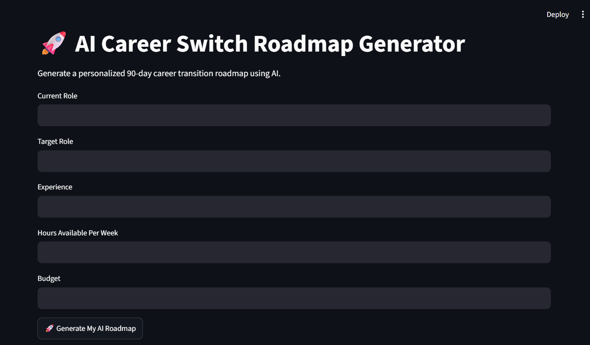
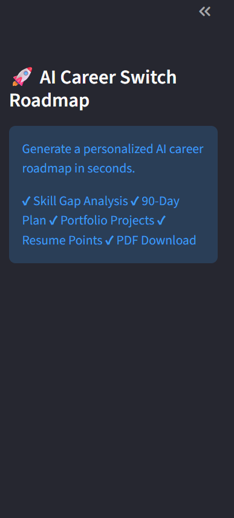
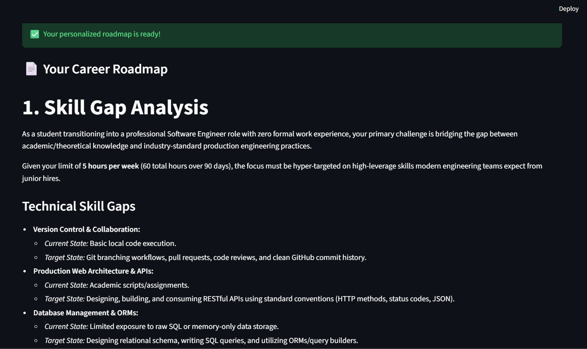
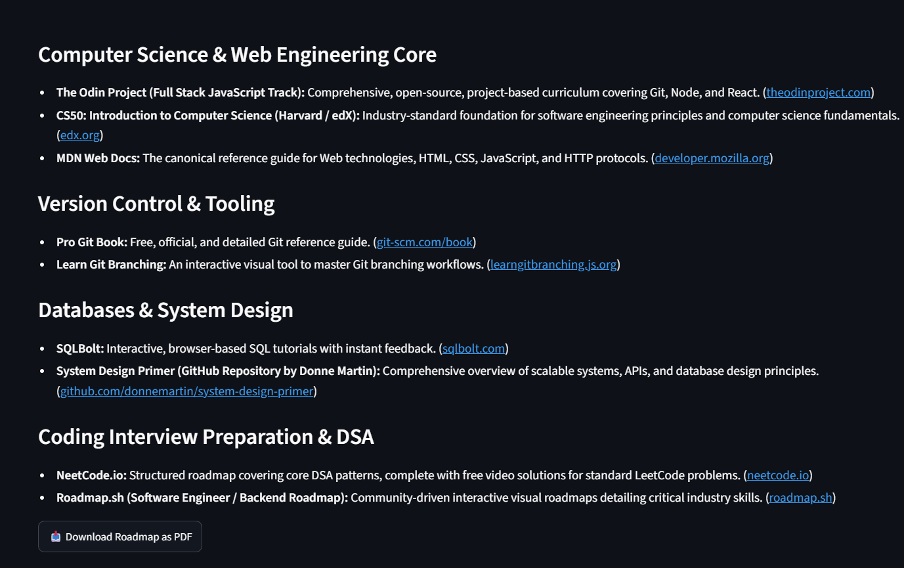
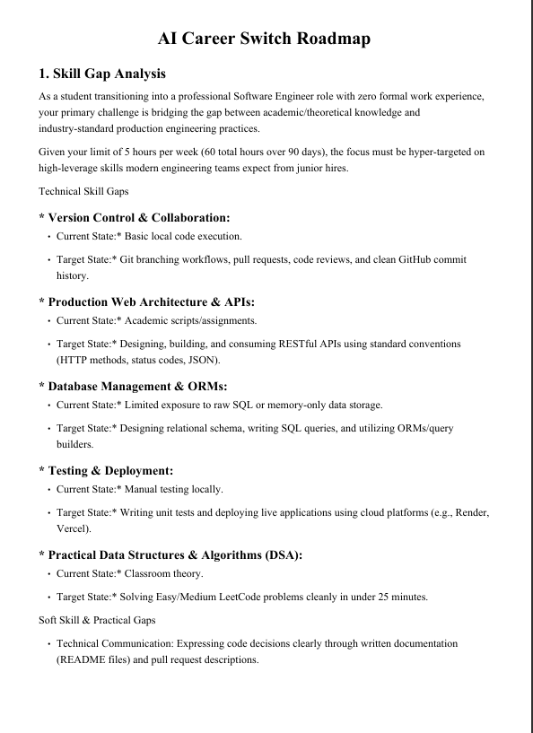

# 🚀 AI Career Switch Roadmap Generator

Generate a personalized **90-day AI career transition roadmap** using **Google Gemini AI** and **Streamlit**. This application helps users identify skill gaps, create a structured learning plan, discover portfolio projects, generate resume bullet points, and download the roadmap as a professional PDF.

---

## ✨ Features

- 🤖 AI-powered personalized career roadmap
- 📊 Skill Gap Analysis
- 📅 90-Day Learning Plan
- 💼 Portfolio Project Recommendations
- 📝 Resume Bullet Points
- 📚 Free Learning Resources
- 📄 Download Roadmap as PDF
- 🎈 User-friendly Streamlit interface

---

## 🛠️ Tech Stack

- Python
- Streamlit
- Google Gemini API
- ReportLab
- python-dotenv

---

## 🚀 Live Demo

[](https://careerroadmap.streamlit.app/)

Try the application live and generate your own AI career roadmap.
---

## 📂 Project Structure

```text
AI-Career-Roadmap/
│
├── app/
│   ├── app.py
│   └── test_model.py
│
├── prompts/
│   └── career_prompt.txt
│
├── screenshots/
│   ├── 01_home.png
│   ├── 02_sidebar.png
│   ├── 03_generated_roadmap.png
│   ├── 04_download_pdf.png
│   └── 05_generated_pdf.png
│
├── .env
├── .gitignore
├── README.md
└── requirements.txt
```

---

# 📸 Application Screenshots

## 🏠 Home Page



---

## 📋 Sidebar



---

## 🤖 Generated Career Roadmap



---

## 📥 Download PDF



---

## 📄 Generated PDF



---

# ⚙️ Installation

### 1. Clone the Repository

```bash
[git clone - https://github.com/Sne5297/AI-Career-Roadmap]
```

### 2. Go to the Project Folder

```bash
cd AI-Career-Roadmap
```

### 3. Create a Virtual Environment

```bash
python -m venv venv
```

### 4. Activate Virtual Environment

#### Windows

```bash
venv\Scripts\activate
```

#### macOS/Linux

```bash
source venv/bin/activate
```

### 5. Install Dependencies

```bash
pip install -r requirements.txt
```

---

# 🔑 Configure API Key

Create a `.env` file in the project root.

```env
GOOGLE_API_KEY=YOUR_API_KEY
```

---

# ▶️ Run the Application

```bash
streamlit run app/app.py
```

The application will automatically open in your web browser.

---

# 📥 Output

The application generates:

- Personalized Skill Gap Analysis
- 90-Day Learning Plan
- Portfolio Projects
- Resume Bullet Points
- Free Learning Resources
- Downloadable PDF Report

---

# 🚀 Future Enhancements

- User Login System
- Save Previous Roadmaps
- Dark Mode
- Export to Word (.docx)
- Multiple AI Model Support
- Learning Progress Tracker

---

# 👩‍💻 Developer

**Sneha B S**

Computer Science Engineering 

---

# ⭐ If you like this project

If you found this project useful, consider giving it a ⭐ on GitHub!

---

# 📄 License

This project is intended for educational and portfolio purposes.
